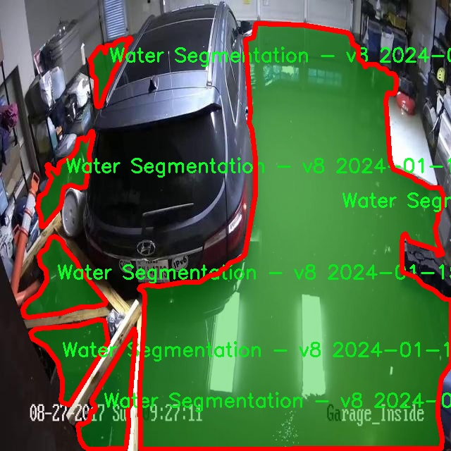

# 水体分割系统： yolov8-seg-LSKNet

### 1.研究背景与意义

[参考博客](https://gitee.com/YOLOv8_YOLOv11_Segmentation_Studio/projects)

[博客来源](https://kdocs.cn/l/cszuIiCKVNis)

研究背景与意义

随着全球水资源短缺问题的日益严重，水体的监测与管理变得愈发重要。水体不仅是生态系统的重要组成部分，也是人类生存和发展的基础资源。因此，如何高效、准确地进行水体分割与监测，成为了环境科学、遥感技术及计算机视觉等多个领域的研究热点。传统的水体分割方法多依赖于人工经验和简单的图像处理技术，难以适应复杂多变的自然环境，且在处理大规模数据时效率低下。近年来，深度学习技术的迅猛发展为水体分割提供了新的解决方案，尤其是基于卷积神经网络（CNN）的实例分割模型，展现出了优异的性能。

YOLO（You Only Look Once）系列模型因其高效的实时检测能力而受到广泛关注。YOLOv8作为该系列的最新版本，结合了多种先进的技术，具备了更强的特征提取能力和更快的推理速度。然而，尽管YOLOv8在目标检测方面表现出色，但在水体分割任务中仍存在一些局限性，例如对水体边界的细致处理不足、对复杂背景的适应性较差等。因此，基于改进YOLOv8的水体分割系统的研究具有重要的理论和实际意义。

本研究所使用的数据集包含2000幅图像，涵盖了水体分割的两个主要类别，旨在为模型的训练和验证提供丰富的样本。通过对这些图像进行标注和分类，研究者能够深入分析水体的特征及其在不同环境下的表现，从而为模型的改进提供数据支持。具体而言，研究将聚焦于如何优化YOLOv8的网络结构，提升其在水体分割任务中的表现，包括对水体边界的精确定位和对复杂背景的有效抑制。

在环境保护和资源管理日益受到重视的背景下，基于改进YOLOv8的水体分割系统不仅能够为水体监测提供高效的技术支持，还能够为相关政策的制定提供科学依据。通过准确识别和分割水体，研究者可以更好地评估水体的质量、分布及其变化趋势，从而为水资源的可持续利用提供保障。此外，该系统的成功应用还将推动计算机视觉技术在环境科学领域的进一步发展，促进多学科交叉合作。

综上所述，基于改进YOLOv8的水体分割系统的研究，不仅具有重要的学术价值，还具备广泛的应用前景。通过不断优化和完善该系统，研究者能够为水体监测与管理提供更加精准、高效的解决方案，为应对全球水资源危机贡献力量。

### 2.图片演示


注意：本项目提供完整的训练源码数据集和训练教程,由于此博客编辑较早,暂不提供权重文件（best.pt）,需要按照6.训练教程进行训练后实现上图效果。

### 3.视频演示

[3.1 视频演示](https://www.bilibili.com/video/BV1KbmXYDE1z/)

### 4.数据集信息

##### 4.1 数据集类别数＆类别名

nc: 2
names: ['Water Segmentation - v8 2024-01-15 2-51pm', 'object']


##### 4.2 数据集信息简介

数据集信息展示

在进行水体分割系统的训练过程中，"seg_water"数据集扮演了至关重要的角色。该数据集专为改进YOLOv8-seg模型而设计，旨在提高水体的检测和分割精度。数据集的类别数量为2，分别为“Water Segmentation - v8 2024-01-15 2-51pm”和“object”。这些类别的设置不仅反映了数据集的多样性，还为模型的训练提供了丰富的样本，使其能够在不同场景下有效识别和分割水体。

“Water Segmentation - v8 2024-01-15 2-51pm”类别专注于水体的精确分割，包含了大量高质量的水体图像。这些图像涵盖了各种水体类型，如湖泊、河流、池塘等，展示了不同的水面状态和环境条件。这一类别的图像经过精心标注，确保了每个水体区域的边界清晰可辨，为模型的训练提供了可靠的参考数据。通过对这些图像的学习，YOLOv8-seg模型能够捕捉到水体的特征，从而在实际应用中实现高效的水体分割。

另一方面，“object”类别则涵盖了与水体相关的其他物体。这些物体可能包括岸边的植物、漂浮物体、以及水体周围的建筑物等。通过将这些对象纳入训练数据，模型不仅能够更好地理解水体的上下文环境，还能提高其在复杂场景中的分割能力。这种多样化的训练数据使得模型在面对不同的挑战时，能够保持较高的鲁棒性和准确性。

数据集的构建过程注重数据的多样性和代表性，确保模型在训练过程中能够接触到各种不同的水体场景。通过对不同光照条件、天气变化以及水体状态的图像进行收集和标注，"seg_water"数据集为模型提供了一个全面的学习平台。这种全面性不仅提升了模型的泛化能力，也为其在实际应用中的表现奠定了坚实的基础。

在训练过程中，研究人员将利用“seg_water”数据集进行多轮次的模型优化。通过不断调整模型参数和训练策略，力求在水体分割的精度和速度之间找到最佳平衡点。此外，数据集的持续更新和扩展也将为后续的研究提供更多的可能性。随着新数据的加入，模型的适应性和准确性将不断提升，从而满足日益增长的水体监测和管理需求。

总之，"seg_water"数据集的设计和应用为改进YOLOv8-seg的水体分割系统提供了强有力的支持。通过对水体及其相关对象的全面标注和分类，该数据集不仅提升了模型的训练效果，也为未来的研究提供了宝贵的资源。随着技术的不断进步和数据集的不断丰富，水体分割的研究将迎来更加广阔的发展前景。




### 5.项目依赖环境部署教程（零基础手把手教学）

[5.1 环境部署教程链接（零基础手把手教学）](https://www.bilibili.com/video/BV1jG4Ve4E9t/?vd_source=bc9aec86d164b67a7004b996143742dc)


[5.2 安装Python虚拟环境创建和依赖库安装视频教程链接（零基础手把手教学）](https://www.bilibili.com/video/BV1nA4VeYEze/?vd_source=bc9aec86d164b67a7004b996143742dc)

### 6.手把手YOLOV8-seg训练视频教程（零基础手把手教学）

[6.1 手把手YOLOV8-seg训练视频教程（零基础小白有手就能学会）](https://www.bilibili.com/video/BV1cA4VeYETe/?vd_source=bc9aec86d164b67a7004b996143742dc)


按照上面的训练视频教程链接加载项目提供的数据集，运行train.py即可开始训练



     Epoch   gpu_mem       box       obj       cls    labels  img_size
     1/200     0G   0.01576   0.01955  0.007536        22      1280: 100%|██████████| 849/849 [14:42<00:00,  1.04s/it]
               Class     Images     Labels          P          R     mAP@.5 mAP@.5:.95: 100%|██████████| 213/213 [01:14<00:00,  2.87it/s]
                 all       3395      17314      0.994      0.957      0.0957      0.0843

     Epoch   gpu_mem       box       obj       cls    labels  img_size
     2/200     0G   0.01578   0.01923  0.007006        22      1280: 100%|██████████| 849/849 [14:44<00:00,  1.04s/it]
               Class     Images     Labels          P          R     mAP@.5 mAP@.5:.95: 100%|██████████| 213/213 [01:12<00:00,  2.95it/s]
                 all       3395      17314      0.996      0.956      0.0957      0.0845

     Epoch   gpu_mem       box       obj       cls    labels  img_size
     3/200     0G   0.01561    0.0191  0.006895        27      1280: 100%|██████████| 849/849 [10:56<00:00,  1.29it/s]
               Class     Images     Labels          P          R     mAP@.5 mAP@.5:.95: 100%|███████   | 187/213 [00:52<00:00,  4.04it/s]
                 all       3395      17314      0.996      0.957      0.0957      0.0845


### 7.50+种全套YOLOV8-seg创新点加载调参实验视频教程（一键加载写好的改进模型的配置文件）

[7.1 50+种全套YOLOV8-seg创新点加载调参实验视频教程（一键加载写好的改进模型的配置文件）](https://www.bilibili.com/video/BV1Hw4VePEXv/?vd_source=bc9aec86d164b67a7004b996143742dc)

### YOLOV8-seg算法简介

原始YOLOv8-seg算法原理

YOLOv8-seg算法是YOLO系列目标检测模型的最新版本，旨在通过引入先进的技术和改进来提升目标检测的性能和灵活性。该算法不仅在目标检测方面表现出色，还扩展了对图像分割任务的支持，使其在多种计算机视觉应用中具备更强的适应性和实用性。YOLOv8-seg的架构由三个主要部分组成：Backbone、Neck和Head，每个部分都在前代模型的基础上进行了优化和改进。

在特征提取方面，YOLOv8-seg采用了CSPDarknet作为Backbone，这一结构通过将网络分为两个部分并引入多个残差块，显著提高了特征提取的效率和效果。与YOLOv5相比，YOLOv8-seg引入了C2f模块，替代了C3模块。C2f模块的设计灵感来源于ELAN（Efficient Layer Aggregation Network），其核心思想是通过将输入特征图分为两个分支来进行特征提取。每个分支经过卷积层进行降维处理，并且C2f模块的输出也被用作进一步的特征融合。这种结构不仅增加了特征图的维度，还通过融合不同分支的特征图，提升了模型对复杂场景的理解能力。

YOLOv8-seg在特征提取的同时，采用了快速空间金字塔池化（SPPF）结构，旨在有效提取不同尺度的特征。这一结构通过减少模型的参数量和计算量，进一步提高了特征提取的效率，使得YOLOv8-seg能够在多种应用场景中保持高效的运行速度和准确度。特征提取完成后，YOLOv8-seg通过特征金字塔网络（FPN）和路径聚合网络（PAN）结构实现特征的融合与压缩。这一结构通过多个卷积层和池化层的组合，有效地处理和整合了不同层次的特征信息，从而为后续的目标检测和分割任务提供了强有力的支持。

在目标检测方面，YOLOv8-seg采用了无锚框（Anchor-Free）的检测方式，直接预测目标的中心点和宽高比例。这一创新不仅减少了对Anchor框的依赖，还显著提高了检测速度和准确度。此外，YOLOv8-seg在损失函数的设计上也进行了优化，采用了VFLLoss作为分类损失，并结合DFLLoss和CIoULoss来提升模型的分类和回归性能。这种损失函数的选择，使得模型在面对复杂场景时，能够更好地处理样本不平衡的问题，提升了整体的检测精度。

YOLOv8-seg的Head部分设计了三个解耦头，分别用于目标分类和边框回归。通过将分类和回归任务解耦，YOLOv8-seg能够更有效地利用提取到的特征信息，提升检测的准确性和效率。Head部分的输出特征图经过处理后，能够生成多尺度的检测结果，确保模型在不同分辨率下都能保持良好的性能。

在样本匹配策略上，YOLOv8-seg采用了Task-Aligned的Assigner匹配方式，取代了以往的静态匹配。这一策略的引入，使得模型在训练过程中能够更灵活地适应不同类型的样本，提高了训练的效率和效果。数据预处理方面，YOLOv8-seg沿用了YOLOv5的策略，包括马赛克增强、混合增强、空间扰动和颜色扰动等多种增强手段，以提升模型的泛化能力。

值得一提的是，YOLOv8-seg在处理小目标时表现尤为突出。由于小目标在图像中的占比通常较低，导致训练过程中正负样本的不平衡，YOLOv8-seg通过引入Focal Loss损失函数，有效地解决了这一问题。Focal Loss通过调节样本的权重，使得模型在训练时能够更加关注难以分类的小目标，从而提升了整体的检测精度。

总的来说，YOLOv8-seg算法在目标检测和图像分割任务中展现出了卓越的性能。通过引入创新的网络结构和优化的损失函数，YOLOv8-seg不仅提高了检测的准确性和速度，还增强了模型在多种应用场景中的适应性。这使得YOLOv8-seg成为当前计算机视觉领域中最具潜力和实用性的算法之一，为后续的研究和应用提供了坚实的基础。


### 9.系统功能展示（检测对象为举例，实际内容以本项目数据集为准）

图9.1.系统支持检测结果表格显示

  图9.2.系统支持置信度和IOU阈值手动调节

  图9.3.系统支持自定义加载权重文件best.pt(需要你通过步骤5中训练获得)

  图9.4.系统支持摄像头实时识别

  图9.5.系统支持图片识别

  图9.6.系统支持视频识别

  图9.7.系统支持识别结果文件自动保存

  图9.8.系统支持Excel导出检测结果数据


### 10.50+种全套YOLOV8-seg创新点原理讲解（非科班也可以轻松写刊发刊，V11版本正在科研待更新）

#### 10.1 由于篇幅限制，每个创新点的具体原理讲解就不一一展开，具体见下列网址中的创新点对应子项目的技术原理博客网址【Blog】：


[10.1 50+种全套YOLOV8-seg创新点原理讲解链接](https://gitee.com/qunmasj/good)

#### 10.2 部分改进模块原理讲解(完整的改进原理见上图和技术博客链接)【如果此小节的图加载失败可以通过CSDN或者Github搜索该博客的标题访问原始博客，原始博客图片显示正常】

### Gold-YOLO


#### Preliminaries
YOLO系列的中间层结构采用了传统的FPN结构，其中包含多个分支用于多尺度特征融合。然而，它只充分融合来自相邻级别的特征，对于其他层次的信息只能间接地进行“递归”获取。

传统的FPN结构在信息传输过程中存在丢失大量信息的问题。这是因为层之间的信息交互仅限于中间层选择的信息，未被选择的信息在传输过程中被丢弃。这种情况导致某个Level的信息只能充分辅助相邻层，而对其他全局层的帮助较弱。因此，整体上信息融合的有效性可能受到限制。
为了避免在传输过程中丢失信息，本文采用了一种新颖的“聚集和分发”机制（GD），放弃了原始的递归方法。该机制使用一个统一的模块来收集和融合所有Level的信息，并将其分发到不同的Level。通过这种方式，作者不仅避免了传统FPN结构固有的信息丢失问题，还增强了中间层的部分信息融合能力，而且并没有显著增加延迟。


#### 低阶聚合和分发分支 Low-stage gather-and-distribute branch
从主干网络中选择输出的B2、B3、B4、B5特征进行融合，以获取保留小目标信息的高分辨率特征。


#### 高阶聚合和分发分支 High-stage gather-and-distribute branch
高级全局特征对齐模块（High-GD）将由低级全局特征对齐模块（Low-GD）生成的特征{P3, P4, P5}进行融合。


Transformer融合模块由多个堆叠的transformer组成，transformer块的数量为L。每个transformer块包括一个多头注意力块、一个前馈网络（FFN）和残差连接。采用与LeViT相同的设置来配置多头注意力块，使用16个通道作为键K和查询Q的头维度，32个通道作为值V的头维度。为了加速推理过程，将层归一化操作替换为批归一化，并将所有的GELU激活函数替换为ReLU。为了增强变换器块的局部连接，在两个1x1卷积层之间添加了一个深度卷积层。同时，将FFN的扩展因子设置为2，以在速度和计算成本之间取得平衡。


信息注入模块(Information injection module)： 高级全局特征对齐模块（High-GD）中的信息注入模块与低级全局特征对齐模块（Low-GD）中的相同。在高级阶段，局部特征（Flocal）等于Pi，因此公式如下所示：


#### 增强的跨层信息流动 Enhanced cross-layer information flow
为了进一步提升性能，从YOLOv6 中的PAFPN模块中得到启发，引入了Inject-LAF模块。该模块是注入模块的增强版，包括了一个轻量级相邻层融合（LAF）模块，该模块被添加到注入模块的输入位置。为了在速度和准确性之间取得平衡，设计了两个LAF模型：LAF低级模型和LAF高级模型，分别用于低级注入（合并相邻两层的特征）和高级注入（合并相邻一层的特征）。它们的结构如图5(b)所示。为了确保来自不同层级的特征图与目标大小对齐，在实现中的两个LAF模型仅使用了三个操作符：双线性插值（上采样过小的特征）、平均池化（下采样过大的特征）和1x1卷积（调整与目标通道不同的特征）。模型中的LAF模块与信息注入模块的结合有效地平衡了准确性和速度之间的关系。通过使用简化的操作，能够增加不同层级之间的信息流路径数量，从而提高性能而不显著增加延迟。


### 11.项目核心源码讲解（再也不用担心看不懂代码逻辑）

#### 11.1 ultralytics\utils\callbacks\hub.py

以下是对给定代码的核心部分进行提炼和详细注释的结果：

```python
# Ultralytics YOLO 🚀, AGPL-3.0 license

import json
from time import time
from ultralytics.hub.utils import HUB_WEB_ROOT, PREFIX, events
from ultralytics.utils import LOGGER, SETTINGS

def on_fit_epoch_end(trainer):
    """在每个训练周期结束时上传训练进度指标。"""
    session = getattr(trainer, 'hub_session', None)  # 获取训练器的会话对象
    if session:
        # 获取当前训练损失和指标
        all_plots = {**trainer.label_loss_items(trainer.tloss, prefix='train'), **trainer.metrics}
        # 如果是第一个周期，添加模型信息
        if trainer.epoch == 0:
            from ultralytics.utils.torch_utils import model_info_for_loggers
            all_plots = {**all_plots, **model_info_for_loggers(trainer)}
        
        # 将当前周期的指标添加到会话的指标队列中
        session.metrics_queue[trainer.epoch] = json.dumps(all_plots)
        
        # 检查是否超过上传速率限制
        if time() - session.timers['metrics'] > session.rate_limits['metrics']:
            session.upload_metrics()  # 上传指标
            session.timers['metrics'] = time()  # 重置计时器
            session.metrics_queue = {}  # 重置指标队列

def on_model_save(trainer):
    """以速率限制的方式将检查点保存到Ultralytics HUB。"""
    session = getattr(trainer, 'hub_session', None)  # 获取训练器的会话对象
    if session:
        is_best = trainer.best_fitness == trainer.fitness  # 判断当前模型是否是最佳模型
        # 检查是否超过上传速率限制
        if time() - session.timers['ckpt'] > session.rate_limits['ckpt']:
            LOGGER.info(f'{PREFIX}Uploading checkpoint {HUB_WEB_ROOT}/models/{session.model_id}')  # 日志记录上传信息
            session.upload_model(trainer.epoch, trainer.last, is_best)  # 上传模型
            session.timers['ckpt'] = time()  # 重置计时器

def on_train_end(trainer):
    """在训练结束时将最终模型和指标上传到Ultralytics HUB。"""
    session = getattr(trainer, 'hub_session', None)  # 获取训练器的会话对象
    if session:
        LOGGER.info(f'{PREFIX}Syncing final model...')  # 日志记录同步信息
        # 上传最终模型和指标
        session.upload_model(trainer.epoch, trainer.best, map=trainer.metrics.get('metrics/mAP50-95(B)', 0), final=True)
        session.alive = False  # 停止心跳
        LOGGER.info(f'{PREFIX}Done ✅\n'
                    f'{PREFIX}View model at {HUB_WEB_ROOT}/models/{session.model_id} 🚀')  # 日志记录完成信息

# 定义回调函数字典，根据设置决定是否启用
callbacks = {
    'on_fit_epoch_end': on_fit_epoch_end,
    'on_model_save': on_model_save,
    'on_train_end': on_train_end
} if SETTINGS['hub'] is True else {}  # 验证是否启用
```

### 代码分析与注释
1. **导入模块**：导入必要的模块，包括时间处理、JSON处理和Ultralytics库中的工具。
2. **`on_fit_epoch_end` 函数**：
   - 在每个训练周期结束时调用，负责上传训练过程中的指标。
   - 检查会话是否存在，如果存在则获取当前的训练损失和指标，并将其添加到会话的指标队列中。
   - 如果当前周期是第一个周期，还会添加模型信息。
   - 检查是否超过上传速率限制，如果超过则上传指标并重置计时器和队列。
   
3. **`on_model_save` 函数**：
   - 负责将模型检查点上传到Ultralytics HUB。
   - 判断当前模型是否是最佳模型，并检查上传速率限制。
   - 如果满足条件，则上传模型并重置计时器。

4. **`on_train_end` 函数**：
   - 在训练结束时调用，负责上传最终模型和相关指标。
   - 记录同步信息，并上传最终模型，最后停止心跳。

5. **回调函数字典**：根据设置决定是否启用回调函数，包含训练周期结束、模型保存和训练结束的回调。

通过这些核心部分和注释，可以更好地理解代码的功能和逻辑。

这个文件是Ultralytics YOLO项目中的一个回调函数模块，主要用于在训练过程中与Ultralytics HUB进行交互，记录和上传模型训练的相关信息。文件中定义了一系列回调函数，这些函数会在特定的训练阶段被调用，以便进行相应的操作。

首先，文件导入了一些必要的模块，包括`json`和`time`，以及Ultralytics HUB和其他工具的相关功能。接着，定义了一些回调函数，这些函数的作用如下：

- `on_pretrain_routine_end(trainer)`：在预训练例程结束时调用，主要用于记录信息并开始上传速率限制的计时器。如果训练器对象中存在`hub_session`，则会记录模型的URL并初始化计时器。

- `on_fit_epoch_end(trainer)`：在每个训练周期结束时调用，负责上传训练进度的指标。它会将当前的损失和指标信息整理成一个字典，并在满足速率限制的条件下上传这些指标。如果是第一个周期，还会附加模型的相关信息。

- `on_model_save(trainer)`：在模型保存时调用，负责将检查点上传到Ultralytics HUB，并根据速率限制进行控制。如果当前的训练表现是最佳的，则会标记为最佳模型，并上传。

- `on_train_end(trainer)`：在训练结束时调用，负责上传最终的模型和指标到Ultralytics HUB。它会记录上传过程，并在完成后停止心跳信号。

- `on_train_start(trainer)`、`on_val_start(validator)`、`on_predict_start(predictor)`和`on_export_start(exporter)`：这些函数在训练、验证、预测和导出开始时调用，主要用于执行与这些事件相关的操作。

最后，文件定义了一个`callbacks`字典，包含了所有的回调函数。如果设置中启用了HUB功能，则会将这些回调函数注册到字典中，以便在训练过程中根据需要调用。

整体来看，这个文件的主要功能是通过回调机制与Ultralytics HUB进行交互，记录和上传训练过程中的各种信息，以便于后续的模型管理和分析。

#### 11.2 ultralytics\models\yolo\classify\train.py

以下是经过简化和注释的核心代码部分，主要关注于分类训练器的实现：

```python
import torch
from ultralytics.data import ClassificationDataset, build_dataloader
from ultralytics.engine.trainer import BaseTrainer
from ultralytics.models import yolo
from ultralytics.nn.tasks import ClassificationModel
from ultralytics.utils import DEFAULT_CFG, LOGGER, RANK, colorstr
from ultralytics.utils.torch_utils import torch_distributed_zero_first

class ClassificationTrainer(BaseTrainer):
    """
    扩展自 BaseTrainer 类，用于基于分类模型的训练。
    """

    def __init__(self, cfg=DEFAULT_CFG, overrides=None, _callbacks=None):
        """初始化 ClassificationTrainer 对象，支持配置覆盖和回调函数。"""
        if overrides is None:
            overrides = {}
        overrides['task'] = 'classify'  # 设置任务类型为分类
        if overrides.get('imgsz') is None:
            overrides['imgsz'] = 224  # 默认图像大小为224
        super().__init__(cfg, overrides, _callbacks)

    def set_model_attributes(self):
        """从加载的数据集中设置 YOLO 模型的类名。"""
        self.model.names = self.data['names']

    def get_model(self, cfg=None, weights=None, verbose=True):
        """返回配置好的 PyTorch 模型以进行 YOLO 训练。"""
        model = ClassificationModel(cfg, nc=self.data['nc'], verbose=verbose and RANK == -1)
        if weights:
            model.load(weights)  # 加载权重

        for m in model.modules():
            if not self.args.pretrained and hasattr(m, 'reset_parameters'):
                m.reset_parameters()  # 重置参数
            if isinstance(m, torch.nn.Dropout) and self.args.dropout:
                m.p = self.args.dropout  # 设置 dropout
        for p in model.parameters():
            p.requires_grad = True  # 设置为可训练
        return model

    def build_dataset(self, img_path, mode='train'):
        """根据图像路径和模式（训练/测试等）创建 ClassificationDataset 实例。"""
        return ClassificationDataset(root=img_path, args=self.args, augment=mode == 'train', prefix=mode)

    def get_dataloader(self, dataset_path, batch_size=16, rank=0, mode='train'):
        """返回用于推理的 PyTorch DataLoader，并进行图像预处理。"""
        with torch_distributed_zero_first(rank):  # 在分布式环境中只初始化一次数据集
            dataset = self.build_dataset(dataset_path, mode)

        loader = build_dataloader(dataset, batch_size, self.args.workers, rank=rank)
        return loader  # 返回数据加载器

    def preprocess_batch(self, batch):
        """预处理一批图像和类标签。"""
        batch['img'] = batch['img'].to(self.device)  # 将图像移动到设备
        batch['cls'] = batch['cls'].to(self.device)  # 将类标签移动到设备
        return batch

    def get_validator(self):
        """返回用于验证的 ClassificationValidator 实例。"""
        self.loss_names = ['loss']  # 定义损失名称
        return yolo.classify.ClassificationValidator(self.test_loader, self.save_dir)

    def final_eval(self):
        """评估训练后的模型并保存验证结果。"""
        for f in self.last, self.best:
            if f.exists():
                if f is self.best:
                    LOGGER.info(f'\nValidating {f}...')
                    self.metrics = self.validator(model=f)  # 进行验证
                    self.metrics.pop('fitness', None)  # 移除不需要的指标
        LOGGER.info(f"Results saved to {colorstr('bold', self.save_dir)}")  # 输出结果保存路径
```

### 代码注释说明：
1. **类的定义**：`ClassificationTrainer` 继承自 `BaseTrainer`，用于分类任务的训练。
2. **初始化方法**：设置任务类型为分类，并定义默认图像大小。
3. **模型属性设置**：从数据集中提取类名并赋值给模型。
4. **模型获取**：根据配置和权重加载分类模型，并设置可训练参数。
5. **数据集构建**：根据给定路径和模式创建数据集实例。
6. **数据加载器获取**：构建数据加载器以便于训练和推理。
7. **批处理预处理**：将图像和类标签移动到指定设备（如 GPU）。
8. **验证器获取**：返回用于验证的实例。
9. **最终评估**：评估模型并保存结果，输出结果保存路径。

该代码段的核心功能是实现分类模型的训练和评估，支持数据集的构建和加载。

这个程序文件是一个用于训练分类模型的Python脚本，属于Ultralytics YOLO框架的一部分。它定义了一个名为`ClassificationTrainer`的类，继承自`BaseTrainer`，用于处理图像分类任务。

在文件的开头，导入了一些必要的库和模块，包括PyTorch、Torchvision以及Ultralytics框架中的数据处理、模型构建和训练相关的工具。这些导入为后续的模型训练提供了基础。

`ClassificationTrainer`类的构造函数`__init__`接受配置参数、覆盖参数和回调函数。它会设置任务类型为“分类”，并确保图像大小默认为224像素。接着调用父类的构造函数进行初始化。

`set_model_attributes`方法用于从加载的数据集中设置YOLO模型的类名。`get_model`方法则返回一个经过配置的PyTorch模型，支持加载预训练权重，并根据需要重置模型参数和设置Dropout层的丢弃率。

`setup_model`方法负责加载、创建或下载模型。它可以处理本地模型文件、Torchvision模型或Ultralytics提供的模型。如果模型是以`.pt`结尾的文件，它会尝试加载权重；如果是以`.yaml`或`.yml`结尾的文件，则会调用`get_model`方法；如果是Torchvision的模型名称，则直接创建相应的模型实例。

`build_dataset`方法用于创建一个`ClassificationDataset`实例，接受图像路径和模式（如训练或测试）。`get_dataloader`方法返回一个PyTorch的DataLoader，用于图像的预处理和批量加载，支持分布式训练。

`preprocess_batch`方法用于将图像和类标签移动到指定的设备上（如GPU）。`progress_string`方法返回一个格式化的字符串，显示训练进度，包括当前的epoch、GPU内存使用情况和损失值。

`get_validator`方法返回一个用于验证的`ClassificationValidator`实例，`label_loss_items`方法则返回一个带有标签的损失字典，尽管在分类任务中并不需要这个功能。

`plot_metrics`方法用于从CSV文件中绘制训练指标，`final_eval`方法在训练结束后评估模型并保存验证结果。它会处理最后一次和最佳模型的优化器，并进行验证。

最后，`plot_training_samples`方法用于绘制训练样本及其注释，帮助可视化训练过程中的数据。

总体来说，这个文件提供了一个完整的框架，用于训练和评估图像分类模型，支持多种模型加载方式和数据处理功能，适合于深度学习研究和应用。

#### 11.3 ui_style.py

以下是经过简化和注释的核心代码部分：

```python
import base64
import streamlit as st

# 读取二进制文件并转换为 Base64 编码
def get_base64_of_bin_file(bin_file):
    # 以二进制模式打开文件
    with open(bin_file, 'rb') as file:
        data = file.read()  # 读取文件内容
    # 将读取的二进制数据进行 Base64 编码并解码为字符串
    return base64.b64encode(data).decode()

# 定义 Streamlit 应用的 CSS 样式
def def_css_hitml():
    st.markdown("""
        <style>
        /* 全局样式 */
        .css-2trqyj, .css-1d391kg, .st-bb, .st-at {
            font-family: 'Gill Sans', 'Gill Sans MT', Calibri, 'Trebuchet MS', sans-serif;  /* 设置字体 */
            background-color: #cadefc;  /* 设置背景颜色 */
            color: #21618C;  /* 设置字体颜色 */
        }

        /* 按钮样式 */
        .stButton > button {
            border: none;  /* 去掉边框 */
            color: white;  /* 字体颜色 */
            padding: 10px 20px;  /* 内边距 */
            text-align: center;  /* 文本居中 */
            display: inline-block;  /* 使按钮为块级元素 */
            font-size: 16px;  /* 字体大小 */
            margin: 2px 1px;  /* 外边距 */
            cursor: pointer;  /* 鼠标悬停时显示为手型 */
            border-radius: 8px;  /* 圆角边框 */
            background-color: #9896f1;  /* 背景颜色 */
            box-shadow: 0 2px 4px 0 rgba(0,0,0,0.2);  /* 阴影效果 */
            transition-duration: 0.4s;  /* 过渡效果 */
        }
        .stButton > button:hover {
            background-color: #5499C7;  /* 悬停时背景颜色 */
            color: white;  /* 悬停时字体颜色 */
            box-shadow: 0 8px 12px 0 rgba(0,0,0,0.24);  /* 悬停时阴影效果 */
        }

        /* 侧边栏样式 */
        .css-1lcbmhc.e1fqkh3o0 {
            background-color: #154360;  /* 侧边栏背景颜色 */
            color: #FDFEFE;  /* 侧边栏字体颜色 */
            border-right: 2px solid #DDD;  /* 右边框 */
        }

        /* 表格样式 */
        table {
            border-collapse: collapse;  /* 合并边框 */
            margin: 25px 0;  /* 外边距 */
            font-size: 18px;  /* 字体大小 */
            font-family: sans-serif;  /* 字体 */
            min-width: 400px;  /* 最小宽度 */
            box-shadow: 0 5px 15px rgba(0, 0, 0, 0.2);  /* 阴影效果 */
        }
        thead tr {
            background-color: #a8d8ea;  /* 表头背景颜色 */
            color: #ffcef3;  /* 表头字体颜色 */
            text-align: left;  /* 文本左对齐 */
        }
        th, td {
            padding: 15px 18px;  /* 单元格内边距 */
        }
        tbody tr {
            border-bottom: 2px solid #ddd;  /* 行底部边框 */
        }
        tbody tr:nth-of-type(even) {
            background-color: #D6EAF8;  /* 偶数行背景颜色 */
        }
        tbody tr:last-of-type {
            border-bottom: 3px solid #5499C7;  /* 最后一行底部边框 */
        }
        tbody tr:hover {
            background-color: #AED6F1;  /* 悬停行背景颜色 */
        }
        </style>
        """, unsafe_allow_html=True)  # 允许使用 HTML
```

### 代码注释说明：
1. **导入模块**：导入 `base64` 用于编码和解码，导入 `streamlit` 用于构建 web 应用。
2. **`get_base64_of_bin_file` 函数**：该函数接收一个二进制文件路径，读取文件内容并将其转换为 Base64 编码字符串。
3. **`def_css_hitml` 函数**：该函数用于定义 Streamlit 应用的 CSS 样式，包含全局样式、按钮样式、侧边栏样式和表格样式等，使用 `st.markdown` 方法将 CSS 代码插入到应用中。

这个程序文件 `ui_style.py` 是一个用于 Streamlit 应用的样式定义文件，主要通过 CSS 来美化用户界面。文件中包含了几个主要的功能和样式定义。

首先，程序导入了 `base64` 和 `streamlit` 模块。`base64` 模块用于处理二进制数据的编码，而 `streamlit` 是一个用于构建数据应用的库。

接下来，定义了一个函数 `get_base64_of_bin_file(bin_file)`，该函数接受一个二进制文件的路径作为参数。它打开这个文件并读取其内容，然后将内容编码为 Base64 格式并返回。这种处理通常用于在网页中嵌入图片或其他二进制数据。

然后，定义了 `def_css_hitml()` 函数，该函数使用 `st.markdown` 方法将一段 CSS 样式插入到 Streamlit 应用中。CSS 样式的内容被包含在三重引号中，允许多行字符串的定义。

在 CSS 样式中，首先设置了全局样式，包括字体、背景色和文本颜色。接着，定义了按钮的样式，调整了按钮的边框、颜色、内边距、字体大小、边距、圆角和阴影效果，并为按钮的悬停状态设置了不同的背景色和阴影效果。

此外，侧边栏的样式也被定义，设置了背景色、文本颜色和边框。对于单选按钮（Radio）和滑块（Slider），也分别定义了样式，使其在视觉上更加美观。

最后，表格的样式也被详细定义，包括表格的边框、字体、阴影、表头和表格行的背景色等。通过这些样式的设置，表格在不同状态下（如悬停、偶数行）呈现出不同的视觉效果。

总体来说，这个文件通过 CSS 定义了 Streamlit 应用的多种界面元素的样式，使得应用的用户界面更加美观和易于使用。

#### 11.4 ultralytics\nn\extra_modules\head.py

以下是提取出的核心代码部分，并添加了详细的中文注释：

```python
import torch
import torch.nn as nn
from ultralytics.utils.tal import dist2bbox, make_anchors

class Detect_DyHead(nn.Module):
    """YOLOv8 检测头，使用 DyHead 进行目标检测。"""
    
    def __init__(self, nc=80, hidc=256, block_num=2, ch=()):
        super().__init__()
        self.nc = nc  # 类别数量
        self.nl = len(ch)  # 检测层数量
        self.reg_max = 16  # DFL 通道数
        self.no = nc + self.reg_max * 4  # 每个锚点的输出数量
        self.stride = torch.zeros(self.nl)  # 在构建时计算的步幅
        c2, c3 = max((16, ch[0] // 4, self.reg_max * 4)), max(ch[0], self.nc)  # 通道数
        self.conv = nn.ModuleList(nn.Sequential(Conv(x, hidc, 1)) for x in ch)  # 卷积层
        self.dyhead = nn.Sequential(*[DyHeadBlock(hidc) for i in range(block_num)])  # DyHead 模块
        self.cv2 = nn.ModuleList(
            nn.Sequential(Conv(hidc, c2, 3), Conv(c2, c2, 3), nn.Conv2d(c2, 4 * self.reg_max, 1)) for _ in ch)  # 处理边界框的卷积层
        self.cv3 = nn.ModuleList(nn.Sequential(Conv(hidc, c3, 3), Conv(c3, c3, 3), nn.Conv2d(c3, self.nc, 1)) for _ in ch)  # 处理类别的卷积层
        self.dfl = DFL(self.reg_max) if self.reg_max > 1 else nn.Identity()  # DFL 层

    def forward(self, x):
        """连接并返回预测的边界框和类别概率。"""
        for i in range(self.nl):
            x[i] = self.conv[i](x[i])  # 对每个输入进行卷积处理
        x = self.dyhead(x)  # 通过 DyHead 模块
        shape = x[0].shape  # 获取输出形状
        for i in range(self.nl):
            x[i] = torch.cat((self.cv2[i](x[i]), self.cv3[i](x[i])), 1)  # 合并边界框和类别的输出
        if self.training:
            return x  # 如果是训练模式，返回中间结果
        else:
            # 动态锚点生成
            self.anchors, self.strides = (x.transpose(0, 1) for x in make_anchors(x, self.stride, 0.5))
            self.shape = shape

        # 将输出展平并分割为边界框和类别
        x_cat = torch.cat([xi.view(shape[0], self.no, -1) for xi in x], 2)
        box, cls = x_cat.split((self.reg_max * 4, self.nc), 1)  # 分割边界框和类别
        dbox = dist2bbox(self.dfl(box), self.anchors.unsqueeze(0), xywh=True, dim=1) * self.strides  # 计算最终的边界框
        y = torch.cat((dbox, cls.sigmoid()), 1)  # 合并边界框和经过 sigmoid 激活的类别概率
        return y  # 返回最终输出

    def bias_init(self):
        """初始化 Detect() 的偏置，警告：需要步幅可用。"""
        for a, b, s in zip(self.cv2, self.cv3, self.stride):  # 遍历 cv2 和 cv3 的层
            a[-1].bias.data[:] = 1.0  # 初始化边界框的偏置
            b[-1].bias.data[:self.nc] = math.log(5 / self.nc / (640 / s) ** 2)  # 初始化类别的偏置

# 其他检测头类可以类似处理，保留核心结构和功能
```

以上代码保留了 `Detect_DyHead` 类的核心部分，并添加了详细的中文注释，以便于理解其功能和结构。其他检测头类（如 `Detect_AFPN_P345` 等）可以根据需要进行类似的处理。

这个程序文件 `head.py` 是 YOLOv8 模型的一部分，主要定义了不同的检测头（Detect Head）类，用于目标检测任务。文件中包含多个类，每个类都继承自 `nn.Module`，并实现了目标检测所需的功能。

首先，文件导入了一些必要的库和模块，包括 PyTorch 的核心模块 `torch` 和 `torch.nn`，以及一些自定义的模块如 `Conv`, `DFL`, `C2f`, `RepConv`, `Proto` 等。这些模块通常用于构建卷积层、深度特征学习等。

接下来，定义了多个检测头类：

1. **Detect_DyHead**：这是 YOLOv8 的动态检测头，适用于检测模型。它的构造函数接受类别数、隐藏通道数、块数和通道数等参数。它包含多个卷积层和一个动态头块（`DyHeadBlock`），用于处理输入特征图并生成预测的边界框和类别概率。在 `forward` 方法中，输入特征图经过卷积处理后，进行拼接并输出预测结果。

2. **Detect_DyHeadWithDCNV3**：这个类继承自 `Detect_DyHead`，使用了 DCN（Deformable Convolutional Networks）来增强特征提取能力。

3. **Detect_AFPN_P345** 和 **Detect_AFPN_P345_Custom**：这两个类实现了带有自适应特征金字塔网络（AFPN）的检测头。AFPN 通过不同层次的特征融合来提高检测性能。构造函数中定义了 AFPN 模块，并在 `forward` 方法中处理输入特征图。

4. **Detect_AFPN_P2345** 和 **Detect_AFPN_P2345_Custom**：这两个类与上面的 AFPN 类似，但它们使用不同的层次结构来处理特征图。

5. **Detect_Efficient**：这个类实现了高效的检测头，适用于资源受限的环境。它通过简化的卷积结构来减少计算量，同时保持较好的检测性能。

6. **DetectAux**：这个类实现了带有辅助头的检测模型，允许在训练过程中使用额外的输出，以提高模型的性能。

7. **Segment_Efficient**：这是一个用于分割任务的检测头，扩展了 `Detect_Efficient` 类，增加了处理掩膜的能力。它定义了原型（prototypes）和掩膜系数的计算。

每个类都实现了 `forward` 方法，该方法负责定义前向传播的计算过程，处理输入数据并返回模型的输出。此外，某些类还实现了 `bias_init` 方法，用于初始化偏置参数，以便在训练时提供更好的收敛性。

总的来说，这个文件定义了 YOLOv8 模型中用于目标检测的不同检测头，提供了灵活的结构以适应不同的任务需求和模型配置。

#### 11.5 ultralytics\nn\extra_modules\ops_dcnv3\modules\dcnv3.py

以下是提取出的核心代码部分，并附上详细的中文注释：

```python
import torch
from torch import nn
import torch.nn.functional as F
from torch.nn.init import xavier_uniform_, constant_

# 定义一个将通道放在前面的模块
class to_channels_first(nn.Module):
    def __init__(self):
        super().__init__()

    def forward(self, x):
        # 将输入的维度从 (N, H, W, C) 转换为 (N, C, H, W)
        return x.permute(0, 3, 1, 2)

# 定义一个将通道放在最后的模块
class to_channels_last(nn.Module):
    def __init__(self):
        super().__init__()

    def forward(self, x):
        # 将输入的维度从 (N, C, H, W) 转换为 (N, H, W, C)
        return x.permute(0, 2, 3, 1)

# 构建归一化层
def build_norm_layer(dim, norm_layer, in_format='channels_last', out_format='channels_last', eps=1e-6):
    layers = []
    if norm_layer == 'BN':
        if in_format == 'channels_last':
            layers.append(to_channels_first())  # 转换格式
        layers.append(nn.BatchNorm2d(dim))  # 添加批归一化层
        if out_format == 'channels_last':
            layers.append(to_channels_last())  # 转换格式
    elif norm_layer == 'LN':
        if in_format == 'channels_first':
            layers.append(to_channels_last())  # 转换格式
        layers.append(nn.LayerNorm(dim, eps=eps))  # 添加层归一化层
        if out_format == 'channels_first':
            layers.append(to_channels_first())  # 转换格式
    else:
        raise NotImplementedError(f'build_norm_layer does not support {norm_layer}')
    return nn.Sequential(*layers)  # 返回一个顺序容器

# 定义DCNv3模块
class DCNv3(nn.Module):
    def __init__(self, channels=64, kernel_size=3, stride=1, pad=1, dilation=1, group=4, offset_scale=1.0):
        super().__init__()
        if channels % group != 0:
            raise ValueError(f'channels must be divisible by group, but got {channels} and {group}')
        
        self.channels = channels
        self.kernel_size = kernel_size
        self.stride = stride
        self.dilation = dilation
        self.pad = pad
        self.group = group
        self.group_channels = channels // group

        # 定义深度卷积层
        self.dw_conv = nn.Conv2d(channels, channels, kernel_size, stride=stride, padding=pad, groups=channels)
        # 定义偏移量和掩码的线性层
        self.offset = nn.Linear(channels, group * (kernel_size * kernel_size) * 2)
        self.mask = nn.Linear(channels, group * (kernel_size * kernel_size))
        self.input_proj = nn.Linear(channels, channels)  # 输入投影层
        self.output_proj = nn.Linear(channels, channels)  # 输出投影层
        self._reset_parameters()  # 初始化参数

    def _reset_parameters(self):
        # 初始化偏移量和掩码的权重为0
        constant_(self.offset.weight.data, 0.)
        constant_(self.offset.bias.data, 0.)
        constant_(self.mask.weight.data, 0.)
        constant_(self.mask.bias.data, 0.)
        # 输入和输出投影层的权重使用Xavier初始化
        xavier_uniform_(self.input_proj.weight.data)
        constant_(self.input_proj.bias.data, 0.)
        xavier_uniform_(self.output_proj.weight.data)
        constant_(self.output_proj.bias.data, 0.)

    def forward(self, input):
        """
        前向传播
        :param input: 输入张量 (N, H, W, C)
        :return: 输出张量 (N, H, W, C)
        """
        N, H, W, _ = input.shape  # 获取输入的形状

        x = self.input_proj(input)  # 输入投影
        x1 = input.permute(0, 3, 1, 2)  # 转换输入格式为 (N, C, H, W)
        x1 = self.dw_conv(x1)  # 深度卷积操作
        offset = self.offset(x1)  # 计算偏移量
        mask = self.mask(x1).reshape(N, H, W, self.group, -1)  # 计算掩码并调整形状
        mask = F.softmax(mask, -1)  # 对掩码进行softmax归一化

        # 使用DCNv3的核心操作
        x = DCNv3Function.apply(
            x, offset, mask,
            self.kernel_size, self.kernel_size,
            self.stride, self.stride,
            self.pad, self.pad,
            self.dilation, self.dilation,
            self.group, self.group_channels,
            self.offset_scale
        )

        x = self.output_proj(x)  # 输出投影
        return x  # 返回输出
```

### 代码注释说明
1. **模块转换**：`to_channels_first` 和 `to_channels_last` 用于在不同的通道格式之间转换，以便在卷积和归一化操作中保持一致性。
2. **归一化层构建**：`build_norm_layer` 函数根据输入格式和所需的归一化类型（批归一化或层归一化）构建相应的层。
3. **DCNv3模块**：`DCNv3` 类实现了深度可分离卷积的功能，包括输入投影、深度卷积、偏移量和掩码的计算，以及最终的输出投影。
4. **参数初始化**：`_reset_parameters` 方法负责初始化模型中的参数，以确保训练的稳定性和收敛性。
5. **前向传播**：`forward` 方法定义了数据如何通过网络流动，包括输入的格式转换、卷积操作、偏移量和掩码的计算，以及最终的输出生成。

这个程序文件是一个实现了DCNv3（Deformable Convolutional Networks v3）模块的PyTorch代码，主要用于深度学习中的图像处理任务。文件中包含了多个类和函数，下面对其进行逐一说明。

首先，文件引入了一些必要的库，包括PyTorch的核心库和一些功能模块。接着定义了两个类`to_channels_first`和`to_channels_last`，这两个类用于在不同的通道格式之间进行转换，分别将输入的张量从“通道最后”（channels last）格式转换为“通道第一”（channels first）格式，或反之。

接下来，定义了`build_norm_layer`和`build_act_layer`函数，用于构建归一化层和激活层。`build_norm_layer`根据输入的格式和所需的归一化类型（如批归一化BN或层归一化LN）构建相应的层，并处理通道格式的转换。`build_act_layer`则根据输入的激活函数类型（如ReLU、SiLU或GELU）返回相应的激活层。

然后，定义了一个辅助函数`_is_power_of_2`，用于检查一个数是否是2的幂，这在DCNv3的实现中用于优化。

`CenterFeatureScaleModule`类实现了中心特征缩放的功能，它接收查询向量并通过线性变换生成一个缩放因子。

`DCNv3_pytorch`类是DCNv3模块的主要实现。构造函数中接受多个参数，如通道数、卷积核大小、步幅、填充、扩张、分组数等。它会根据这些参数初始化卷积层、线性层和其他组件，并在初始化时进行参数的重置。`forward`方法实现了前向传播过程，包括输入的投影、偏移量和掩码的计算，以及通过DCNv3核心函数进行变形卷积的操作。

`DCNv3`类是DCNv3模块的另一种实现，主要区别在于使用了自定义的卷积类`Conv`，其余结构和功能与`DCNv3_pytorch`相似。

最后，`DCNv3_DyHead`类是DCNv3模块的动态头实现，专门用于处理动态卷积的情况。它的构造函数和`forward`方法与前面的类类似，但它不包含输入投影层，直接接收偏移量和掩码进行处理。

总体而言，这个文件实现了DCNv3模块的多个变体，提供了灵活的接口和功能，以适应不同的深度学习任务和需求。通过这些模块，用户可以在图像处理和计算机视觉任务中利用变形卷积的优势。

### 12.系统整体结构（节选）

### 程序整体功能和构架概括

该程序是Ultralytics YOLO框架的一部分，主要用于目标检测和图像分类任务。整体架构包括多个模块，各自负责不同的功能。程序的核心包括训练、模型定义、样式设置和特征提取等。以下是各个模块的功能概述：

1. **回调函数模块**（`hub.py`）：负责在训练过程中与Ultralytics HUB进行交互，记录和上传训练过程中的指标和模型信息。
2. **分类训练模块**（`train.py`）：实现图像分类模型的训练流程，包括模型构建、数据加载、训练和验证等功能。
3. **用户界面样式模块**（`ui_style.py`）：定义Streamlit应用的样式，通过CSS美化用户界面，提升用户体验。
4. **检测头模块**（`head.py`）：定义YOLOv8模型中的不同检测头，处理目标检测任务中的特征提取和预测。
5. **变形卷积模块**（`dcnv3.py`）：实现DCNv3（Deformable Convolutional Networks v3）模块，提供灵活的卷积操作以增强特征提取能力。

### 文件功能整理表

| 文件路径                                           | 功能描述                                                         |
|--------------------------------------------------|------------------------------------------------------------------|
| `ultralytics/utils/callbacks/hub.py`            | 定义回调函数，用于训练过程中的记录和与Ultralytics HUB的交互。  |
| `ultralytics/models/yolo/classify/train.py`     | 实现图像分类模型的训练流程，包括模型构建、数据加载和验证。    |
| `ui_style.py`                                    | 定义Streamlit应用的CSS样式，提升用户界面的美观性和可用性。    |
| `ultralytics/nn/extra_modules/head.py`          | 定义YOLOv8模型中的不同检测头，处理目标检测的特征提取和预测。  |
| `ultralytics/nn/extra_modules/ops_dcnv3/modules/dcnv3.py` | 实现DCNv3模块，提供变形卷积操作以增强特征提取能力。           |

这个表格总结了每个文件的主要功能，帮助理解程序的整体架构和各个模块之间的关系。

### 13.图片、视频、摄像头图像分割Demo(去除WebUI)代码

在这个博客小节中，我们将讨论如何在不使用WebUI的情况下，实现图像分割模型的使用。本项目代码已经优化整合，方便用户将分割功能嵌入自己的项目中。
核心功能包括图片、视频、摄像头图像的分割，ROI区域的轮廓提取、类别分类、周长计算、面积计算、圆度计算以及颜色提取等。
这些功能提供了良好的二次开发基础。

### 核心代码解读

以下是主要代码片段，我们会为每一块代码进行详细的批注解释：

```python
import random
import cv2
import numpy as np
from PIL import ImageFont, ImageDraw, Image
from hashlib import md5
from model import Web_Detector
from chinese_name_list import Label_list

# 根据名称生成颜色
def generate_color_based_on_name(name):
    ......

# 计算多边形面积
def calculate_polygon_area(points):
    return cv2.contourArea(points.astype(np.float32))

...
# 绘制中文标签
def draw_with_chinese(image, text, position, font_size=20, color=(255, 0, 0)):
    image_pil = Image.fromarray(cv2.cvtColor(image, cv2.COLOR_BGR2RGB))
    draw = ImageDraw.Draw(image_pil)
    font = ImageFont.truetype("simsun.ttc", font_size, encoding="unic")
    draw.text(position, text, font=font, fill=color)
    return cv2.cvtColor(np.array(image_pil), cv2.COLOR_RGB2BGR)

# 动态调整参数
def adjust_parameter(image_size, base_size=1000):
    max_size = max(image_size)
    return max_size / base_size

# 绘制检测结果
def draw_detections(image, info, alpha=0.2):
    name, bbox, conf, cls_id, mask = info['class_name'], info['bbox'], info['score'], info['class_id'], info['mask']
    adjust_param = adjust_parameter(image.shape[:2])
    spacing = int(20 * adjust_param)

    if mask is None:
        x1, y1, x2, y2 = bbox
        aim_frame_area = (x2 - x1) * (y2 - y1)
        cv2.rectangle(image, (x1, y1), (x2, y2), color=(0, 0, 255), thickness=int(3 * adjust_param))
        image = draw_with_chinese(image, name, (x1, y1 - int(30 * adjust_param)), font_size=int(35 * adjust_param))
        y_offset = int(50 * adjust_param)  # 类别名称上方绘制，其下方留出空间
    else:
        mask_points = np.concatenate(mask)
        aim_frame_area = calculate_polygon_area(mask_points)
        mask_color = generate_color_based_on_name(name)
        try:
            overlay = image.copy()
            cv2.fillPoly(overlay, [mask_points.astype(np.int32)], mask_color)
            image = cv2.addWeighted(overlay, 0.3, image, 0.7, 0)
            cv2.drawContours(image, [mask_points.astype(np.int32)], -1, (0, 0, 255), thickness=int(8 * adjust_param))

            # 计算面积、周长、圆度
            area = cv2.contourArea(mask_points.astype(np.int32))
            perimeter = cv2.arcLength(mask_points.astype(np.int32), True)
            ......

            # 计算色彩
            mask = np.zeros(image.shape[:2], dtype=np.uint8)
            cv2.drawContours(mask, [mask_points.astype(np.int32)], -1, 255, -1)
            color_points = cv2.findNonZero(mask)
            ......

            # 绘制类别名称
            x, y = np.min(mask_points, axis=0).astype(int)
            image = draw_with_chinese(image, name, (x, y - int(30 * adjust_param)), font_size=int(35 * adjust_param))
            y_offset = int(50 * adjust_param)

            # 绘制面积、周长、圆度和色彩值
            metrics = [("Area", area), ("Perimeter", perimeter), ("Circularity", circularity), ("Color", color_str)]
            for idx, (metric_name, metric_value) in enumerate(metrics):
                ......

    return image, aim_frame_area

# 处理每帧图像
def process_frame(model, image):
    pre_img = model.preprocess(image)
    pred = model.predict(pre_img)
    det = pred[0] if det is not None and len(det)
    if det:
        det_info = model.postprocess(pred)
        for info in det_info:
            image, _ = draw_detections(image, info)
    return image

if __name__ == "__main__":
    cls_name = Label_list
    model = Web_Detector()
    model.load_model("./weights/yolov8s-seg.pt")

    # 摄像头实时处理
    cap = cv2.VideoCapture(0)
    while cap.isOpened():
        ret, frame = cap.read()
        if not ret:
            break
        ......

    # 图片处理
    image_path = './icon/OIP.jpg'
    image = cv2.imread(image_path)
    if image is not None:
        processed_image = process_frame(model, image)
        ......

    # 视频处理
    video_path = ''  # 输入视频的路径
    cap = cv2.VideoCapture(video_path)
    while cap.isOpened():
        ret, frame = cap.read()
        ......
```


### 14.完整训练+Web前端界面+50+种创新点源码、数据集获取


# [下载链接：https://mbd.pub/o/bread/Z5aWl5dq](https://mbd.pub/o/bread/Z5aWl5dq)